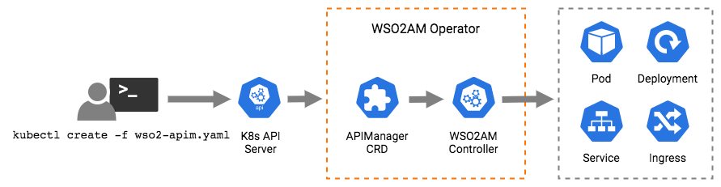

## WSO2 APIM Operator for Kubernetes

Deploying WSO2 APIM Patterns in kubernetes through a simple command. Introducing a new Custom Resource Definition called APIManager to efficiently and easily deploy all 4 patterns, and the custom pattern in Kubernetes.




## Quick Start Guide

In this document, we will walk through the following.
* Setup strorage 
* Deploy pattern-1 in Kubernetes
* Access publisher and devportal

### Installation Prerequisites
* [Kubernetes cluster](https://kubernetes.io/docs/setup/) and client v1.12 or above
* [Helm](https://helm.sh/docs/intro/install/)
* Minimum CPU : **8vCPU** & Minimum Memory : **12GB** for the K8S Cluster

## Steps:
1. Download [wso2am-k8s-operator-1.0.0.zip](https://github.com/wso2/k8s-wso2am-operator/releases/download/1.0.0/wso2am-k8s-operator-1.0.0.zip) and extract it.

2. Setup the required Storage
```
    helm install stable/nfs-server-provisioner
```
   
<details>
<summary>Advanced</summary>
<br>    
<h3>Running External-nfs</h3>

**Prerequisites**
 * A pre-configured Network File System (NFS) to be used as the persistent volume for artifact sharing and persistence. In the NFS server instance, create a Linux system user account named wso2carbon with user id 802 and a system group named wso2 with group id 802. Add the wso2carbon user to the group wso2.

```
    groupadd --system -g 802 wso2
    useradd --system -g 802 -u 802 wso2carbon 
```
    
1.Setup a Network File System (NFS) to be used for persistent storage.
Create and export unique directories within the NFS server instance for each Kubernetes Persistent Volume resource     defined in the <KUBERNETES_HOME>/artifacts/persistent-volumes/persistent-volume-for-external-nfs.yaml file.

2.Grant ownership to wso2carbon user and wso2 group, for each of the previously created directories. 

```
    sudo chown -R wso2carbon:wso2 <directory_name>
```

3.Grant read-write-execute permissions to the wso2carbon user, for each of the previously created directories.

```
    chmod -R 700 <directory_name>
```

4.Update the StorageClassName in the <KUBERNETES_HOME>/artifacts/persistent-volumes/storage-class.yaml file as you want.

Then, apply the following command to create a new Storage Class,

```
    kubectl create -f <KUBERNETES_HOME>/artifacts/persistent-volumes/storage-class.yaml 
```

5.Update each Kubernetes Persistent Volume resource with the corresponding Namespace (NAME_SPACE), NFS server IP (NFS_SERVER_IP) and exported, NFS server directory path (NFS_LOCATION_PATH) in the <KUBERNETES_HOME>/artifacts/persistent-volumes/persistent-volume-for-external-nfs.yaml file.
      
Then, deploy the persistent volume resource as follows,

```
    kubectl create -f <KUBERNETES_HOME>/artifacts/persistent-volumes/persistent-volume-for-external-nfs.yaml -n <USER-NAMESPACE>
```

6.Update PVC Configmap with the corresponding StorageClassName in the <KUBERNETES_HOME>/artifacts/operator-configs/pvc-config.yaml file.

<h3>Using Minikube Hostpath</h3>

Minikube runs a single-node Kubernetes cluster inside a Virtual Machine. Therefore the accessmode ReadWriteMany does not support it, and only ReadWriteOnce supports it. Therefore it is preferred to use other storage methods rather than mnikube hostpath. 

1. Log into Minikube Filesystem via the command,

```
    minikube ssh
```

2. Create unique directories within the Minikube filesystem for each Kubernetes Persistent Volume resource defined in the <KUBERNETES_HOME>/artifacts/persistent-volumes/pv-hostpath.yaml file.

3. Grant permission to mysql directory using the command,
```
    sudo chown 999:999 <mysq-direactory-path>
```
4. Then, deploy the persistent volumes as follows,
```
    kubectl create -f <KUBERNETES_HOME>/artifacts/persistent-volumes/pv-hostpath.yaml -n <USER-NAMESPACE>
```
That is all, Now run the flow in order from start.

 </ul>
</details>

  
    
3. Apply the command to create the operator-artifacts (in wso2-system namespace)

``` 
    kubectl apply -f artifacts/operator-artifacts/ 

    Output: 

    namespace/wso2-system created
    serviceaccount/wso2am-pattern-1-svc-account created
    clusterrole.rbac.authorization.k8s.io/wso2am-controller-role created
    clusterrolebinding.rbac.authorization.k8s.io/wso2am-controller-role-binding created
    customresourcedefinition.apiextensions.k8s.io/apimanagers.apim.wso2.com created
    deployment.apps/wso2am-controller created

```
4. Apply the command below to create operator-configs (in wso2-system namespace)
```
    kubectl apply -f artifacts/operator-configs/
    
    Output:
    
    configmap/operator-config created
    configmap/pvc-config created
```

5. Apply the command below to create pattern-spceific api manager artifacts
```
    kubectl apply -f artifacts/api-manager-artifacts/pattern-1/
    
    Output:
    
    configmap/wso2am-p1-analytics-dash-bin created
    configmap/wso2am-p1-analytics-dash-conf created
    configmap/wso2am-p1-analytics-worker-conf created
    configmap/wso2am-p1-apim-1-conf created
    configmap/wso2am-p1-apim-2-conf created
    configmap/wso2am-p1-mysql-dbscripts created

```

6. Now Let's deploy WSO2 API Manager based on Scenarios. The default and the simplest one is Scenario-1.

```
    kubectl apply -f scenarios/scenario-1/wso2-apim.yaml 

    Output:

    apimanager.apim.wso2.com/cluster-1 created

```

7. Relavant artifact's pods based on specified pattern will be up and running. Check them through below command.
```
    kubectl get pods
    
    Output:
    NAME                                                       READY   STATUS    RESTARTS   AGE
    mysql-cluster-1-787bbf7d7f-dd97x                           1/1     Running   0          3m35s
    wso2-am-1-cluster-1-7c965f55db-r98zh                       1/1     Running   0          3m35s
    wso2-am-2-cluster-1-7dd4669dd-tzl6q                        1/1     Running   0          3m35s
    wso2-am-analytics-dashboard-cluster-1-7654b7b7b7-nnfwc     1/1     Running   0          3m35s
    wso2-am-analytics-worker-cluster-1-67b995dd64-4d4tz        1/1     Running   0          3m35s
```
8. Also you can view the running services through this command.
```
kubectl get svc

NAME                                    TYPE           CLUSTER-IP      EXTERNAL-IP      PORT(S)                                                                                     AGE
wso2-am-1-svc                           LoadBalancer   10.43.245.163   35.244.26.60     8280:32339/TCP,8243:32247/TCP,9763:30327/TCP,9443:31757/TCP                                 118m
wso2-am-2-svc                           LoadBalancer   10.43.244.31    34.93.171.163    8280:32289/TCP,8243:31366/TCP,9763:30954/TCP,9443:31909/TCP                                 118m
Wso2-am-analytics-dashboard-svc         LoadBalancer   10.43.246.200   34.93.74.215     32201:31562/TCP                                                                             118m
wso2-am-analytics-worker-svc            LoadBalancer   10.43.252.140   35.200.217.231   7612:30414/TCP,7712:32469/TCP,9444:32169/TCP,9091:30755/TCP,7071:30125/TCP,7444:31236/TCP   118m
mysql-svc                               ClusterIP      10.43.242.130   <none>           3306/TCP                                                                                    118m

```
9. To access the portals, get the EXTERNAL-IP of any of the 2 apim services (apim-1-svc /apim-2-svc) and add it to your /etc/hosts file of your machine.
```
/etc/hosts
----------
35.244.26.60       wso2apim

```

10. Finally you can successfully access the following portals.
   
   _APIM Publisher_ - https://wso2apim:9443/publisher
   
   _APIM Devportal_ - https://wso2apim:9443/devportal


## Sample Scenarios

1. [Scenario-1 : Applying Simple and shortest Custom Resource YAML](https://github.com/wso2/k8s-wso2am-operator/tree/master/scenarios/scenario-1)
2. [Scenario-2 : Exposing via NodePort Service Type](https://github.com/wso2/k8s-wso2am-operator/tree/master/scenarios/scenario-2)
3. [Scenario-3 : Override Deployment Configuration values](https://github.com/wso2/k8s-wso2am-operator/tree/master/scenarios/scenario-3)
4. [Scenario-4 : Override ConfigMaps and PersistentVolumeClaims](https://github.com/wso2/k8s-wso2am-operator/tree/master/scenarios/scenario-4)
5. [Scenario-5 : Add New Configmaps and Persistent Volume Claims](https://github.com/wso2/k8s-wso2am-operator/tree/master/scenarios/scenario-5)
6. [Scenario-6 : Deploying Custom Pattern](https://github.com/wso2/k8s-wso2am-operator/tree/master/scenarios/scenario-6)
7. [Scenario-7 : Running External-NFS](https://github.com/wso2/k8s-wso2am-operator/tree/master/scenarios/scenario-7)

### Clean up

Execute the following commands if you wish to clean up the Kubernetes cluster by removing all the applied artifacts and configurations related to wso2am-k8s-operator.

```
    kubectl delete -f artifacts/operator-artifacts/
```
  
